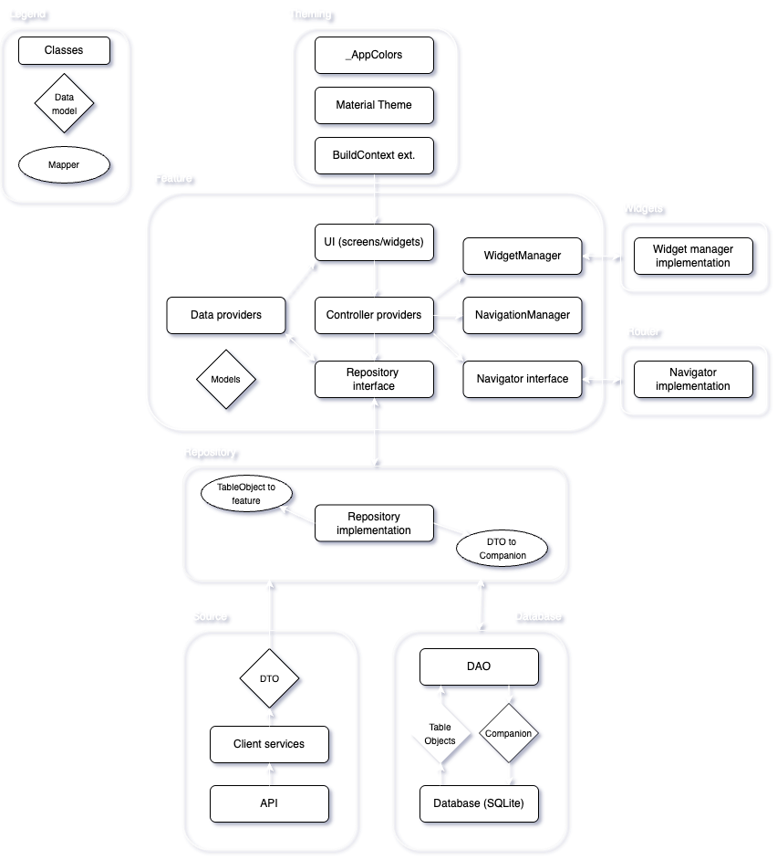

#### [Architecture](/architecture.md)

# Layers

We divide our app into clear and separated layers with each their own responsibility and imports. This makes our app data source agnostic and makes big refactors of certain layers not impact the entire app.

